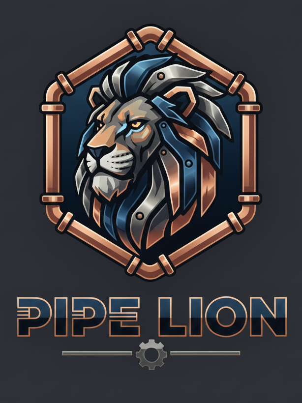

<div align="center"></div>

# Pipe Lion 🦁

**Pipe Lion** is a browser-first packet inspection playground. The goal is to pair a WebAssembly-powered
Rust core with a modern web interface so that packet traces can be explored entirely in the browser.

---

## Prerequisites

- Rust toolchain with the `wasm32-unknown-unknown` target installed
  ```bash
  rustup target add wasm32-unknown-unknown
  ```
- [`wasm-pack`](https://rustwasm.github.io/wasm-pack/installer/) for building the library into a browser-friendly bundle
  ```bash
  cargo install wasm-pack
  ```
- Node.js (>= 18) and npm for the web UI dependencies

---

## Build the WebAssembly Core

From the repository root, run:

```bash
wasm-pack build core --target web --out-dir webapp/public/pkg
```

This command compiles the `core` crate, generates the accompanying JavaScript bindings, and places the artifacts where the
frontend can fetch them (`webapp/public/pkg`). Re-run it whenever you change the Rust code.

---

## Run the Web UI

Install the frontend dependencies and start the development server:

```bash
cd webapp
npm install
npm run dev
```

Vite serves the app at the URL printed in the console (usually `http://localhost:5173`). Drag a `.pcap`, `.pcapng`, or any
binary blob onto the drop zone to see the stubbed response from the WebAssembly module along with a generated hex preview.

To create a production build, run:

```bash
npm run build
```

---

## Development Notes

- The `core` crate is configured with `wasm-bindgen` and exports a `process_packet(data: &[u8]) -> String` helper that will
  eventually produce structured packet information.
- The React UI preloads `core.wasm`, handles drag-and-drop uploads, and renders placeholder panes for packet summaries and hex
  output to make iterating on the Wasm module straightforward.
- Additional tooling (tests, linting, CI) will be added as the project grows.
