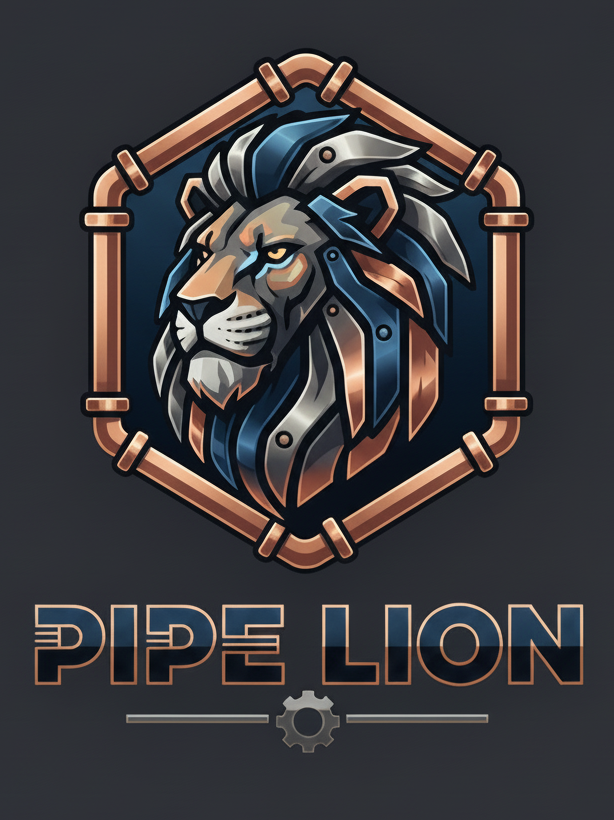

<div align="center"></div>

# Pipe Lion 🦁

**Pipe Lion** is a browser-first packet inspection playground. The goal is to pair a WebAssembly-powered
Rust core with a modern web interface so that packet traces can be explored entirely in the browser.
Wireshark, Pipelion, nevermind... I'll see myself out.

---

## Prerequisites

- Rust toolchain with the `wasm32-unknown-unknown` target installed
  ```bash
  rustup target add wasm32-unknown-unknown
  ```
- [`wasm-pack`](https://rustwasm.github.io/wasm-pack/installer/) for building the library into a browser-friendly bundle
  ```bash
  cargo install wasm-pack
  ```
- Node.js (>= 18) and npm for the web UI dependencies

### Tooling policy

- Frontend dependencies under `docs/` are managed with **npm only**.
- Commit and maintain `docs/package-lock.json`.
- Do **not** add `pnpm-lock.yaml` (or any other frontend lockfile) to avoid split dependency resolution.

---

## Build the WebAssembly Core

From the repository root, run:

```bash
wasm-pack build core --target web --out-dir ../docs/public/pkg
```

This command compiles the `core` crate, generates the accompanying JavaScript bindings, and places the artifacts where the
frontend can fetch them (`docs/public/pkg`). `--out-dir` is resolved relative to the crate, hence the leading `../`. Re-run it
whenever you change the Rust code.

---

## Run the Web UI

Install the frontend dependencies and start the development server:

```bash
cd docs
npm ci
npm run dev
```

Vite serves the app at the URL printed in the console (usually `http://localhost:5173`). Drag a `.pcap`, `.pcapng`, or any
binary blob onto the drop zone and the WebAssembly core parses it in place — nothing is uploaded anywhere.

To create a production build, run:

```bash
npm run build
```

---

## What it does today

Everything runs client-side; the capture never leaves the browser.

**Capture formats.** Classic libpcap (`.pcap`, both endiannesses, microsecond and
nanosecond resolution) and PCAPNG (section headers, interface descriptions,
enhanced and simple packet blocks). Anything else is surfaced as a single raw
payload rather than rejected.

**Dissection.** Ethernet II, IPv4 and IPv6 (including a walk over the common
extension headers), ARP, ICMPv4 and ICMPv6 with type/code descriptions, and TCP,
UDP and SCTP port pairs. Other IP protocol numbers are resolved to a name.
Null/loopback and raw-IP link types are handled alongside Ethernet.

Above the transport layer: **DNS** (over UDP and TCP, including mDNS, with
compression-pointer-aware name decoding) and **TLS** record headers with a full
ClientHello parse — SNI, ALPN and the negotiated version, on any port, not just
443. Those packets are labelled `DNS` and `TLS` in the Protocol column, so
`protocol == dns` and `tls` work as display filters.

**The UI.** A four-pane workspace: a packet list, a diagnostics pane that
separates fatal parse errors from non-fatal warnings (truncated packets,
dangling interface references), a details pane for the selected packet, and a
hex/ASCII dump of its bytes. Arrow keys move through the list.

**Display filters.** A Wireshark-flavoured expression language — `&&`/`||`/`!`
(or `and`/`or`/`not`), parentheses, quoted strings, and `field == value` /
`field contains value` over `time`, `src`/`source`, `dst`/`destination`,
`protocol`, `length` and `info`. A bare word matches anywhere in the row.
Evaluation runs in the Rust core, over packets already in linear memory, and
only the matching indices cross back. The input offers field completions and
keeps recent filters as one-click chips, and syntax errors are underlined in
place instead of silently matching nothing.

**Export.** The current packet set can be written back out as JSON (with
base64 payloads) or as a `.pcap` file.

Your display filter and max-file-size preference persist in `localStorage`.

---

## Development Notes

- The `core` crate is built with `wasm-bindgen` and exports a handle-based
  API: `parse(data) -> CaptureHandle`, then `packet_count`, `warnings`,
  `errors`, `packets(offset, count)` for a window of rows as JSON,
  `payload(index)` for one packet's bytes as a `Uint8Array`, and
  `filter(expression)` for the indices matching a display filter. Nothing that
  crosses the boundary is proportional to the size of the capture. Call
  `free()` when finished — the capture is not garbage collected.
- `cargo test --manifest-path core/Cargo.toml` covers the parsers and
  dissectors; `npm run test -- --run` in `docs/` covers the UI, filter engine
  and exporters. CI runs `cargo fmt --check`, `cargo clippy -D warnings`,
  `cargo test`, and the frontend lint on every pull request.

---

## GitHub Pages Deployment

- Pushes to the `main` branch automatically build the WebAssembly core, bundle the React
  frontend, and publish the static site to GitHub Pages via the workflow defined in
  [`.github/workflows/deploy.yml`](.github/workflows/deploy.yml).
- The Vite configuration detects the repository name from the GitHub Actions environment
  and adjusts the base path so assets resolve correctly when served from
  `https://<username>.github.io/<repository>/`.
- To trigger a manual deployment, run the **Deploy GitHub Pages** workflow from the
  Actions tab in the GitHub UI.
